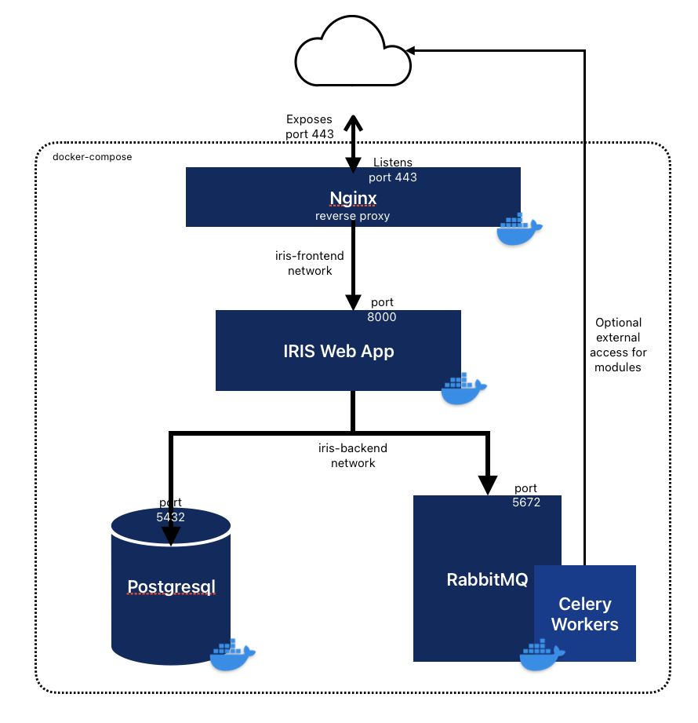
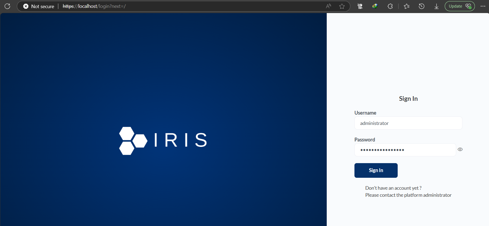
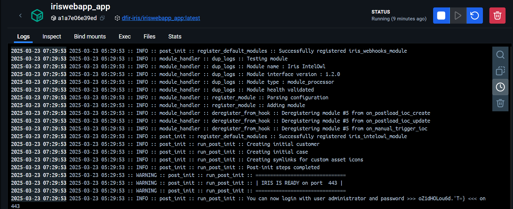
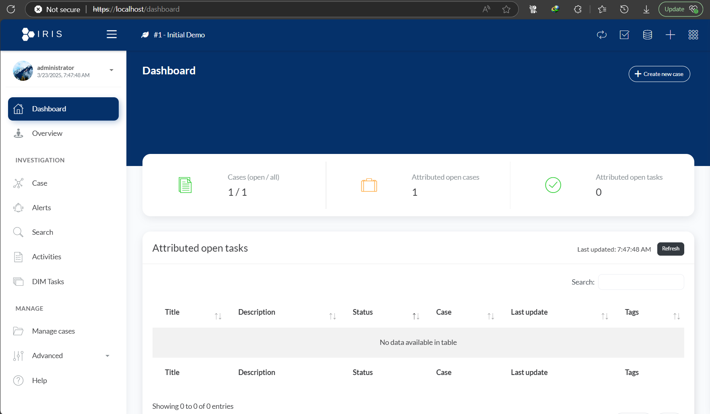
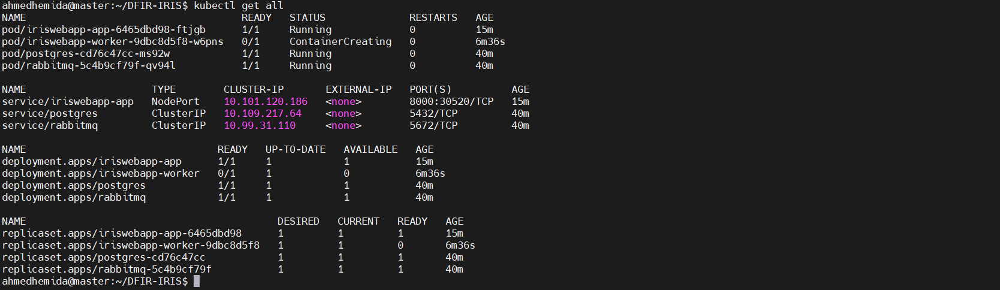
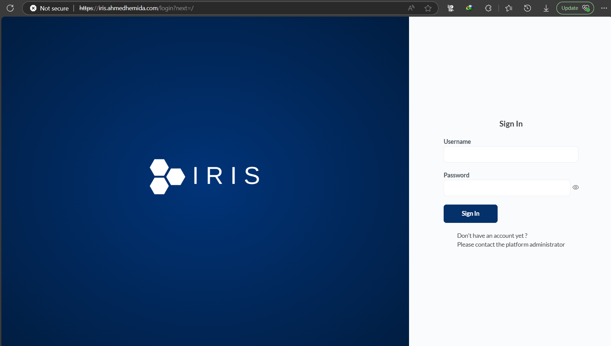
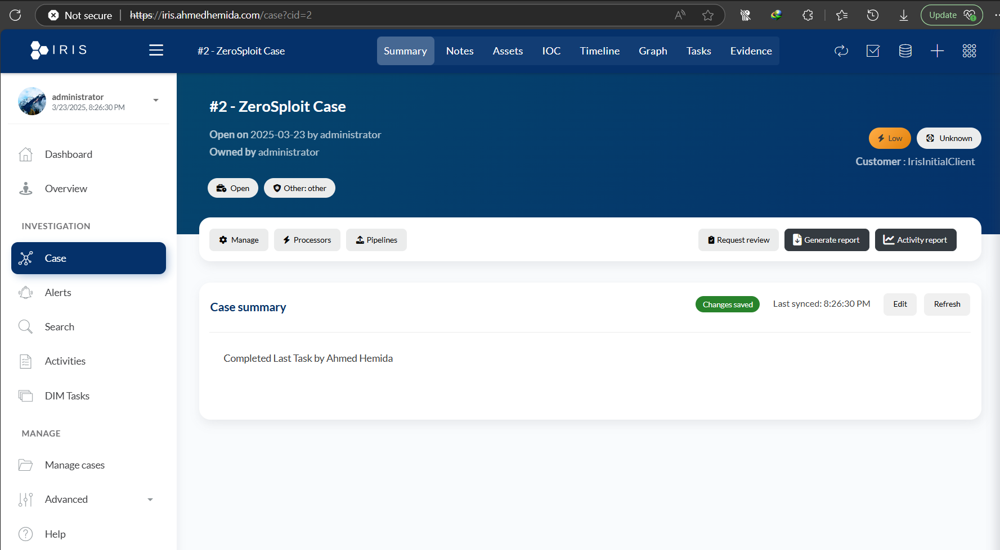

# Task 4: Deploy DFIR-IRIS

DFIR-IRIS is an open-source platform designed for Digital Forensics and Incident Response (DFIR). It is shipped in Docker containers, making it easy to deploy and manage. Below are the detailed steps to deploy DFIR-IRIS using Docker & kubernetes.

---

## Prerequisites

- Docker installed and running on your system.
- Docker Compose installed (if not, follow the [official Docker Compose installation guide](https://docs.docker.com/compose/install/)).

---

## Steps to Deploy DFIR-IRIS


### 1. Clone the DFIR-IRIS Repository

Clone the official DFIR-IRIS GitHub repository to your local machine:

```bash
git clone https://github.com/dfir-iris/iris-web.git
cd iris-web
```

---

### 2. Set Up Environment Variables

DFIR-IRIS requires some environment variables to be set. Create a `.env` file in the root of the project directory and add the following variables:
```bash
cp .env.model .env
```
Then change the nesseccarry env variables
```bash
# .env file
POSTGRES_PASSWORD=__MUST_BE_CHANGED__
POSTGRES_ADMIN_PASSWORD=__MUST_BE_CHANGED__

IRIS_SECRET_KEY=AVerySuperSecretKey-SoNotThisOne
IRIS_SECURITY_PASSWORD_SALT=ARandomSalt-NotThisOneEither

```
---

### 3. Deploy DFIR-IRIS Using Docker Compose

DFIR-IRIS uses Docker Compose to manage its services. Run the following command to start the deployment:

```bash
docker-compose up -d
```

This command will:
- Pull the required Docker images.
- Start the necessary containers (e.g., database, web server).
- Set up the DFIR-IRIS application.

---

### 4. Verify the Deployment

Once the containers are up and running, verify the status of the services:

```bash
docker-compose ps
```

You should see the following services running:
- `web` (DFIR-IRIS web application, including web server, database management, module management, etc.).
- `db` (A PostgreSQL database for IRIS).
- `rabbitmq` (A RabbitMQ engine to handle job queuing and processing).
- `nginx` (A NGINX reverse proxy).

---

### 5. Access DFIR-IRIS Web Interface

DFIR-IRIS should now be accessible via your web browser. Open the following URL:

```sh
https://localhost
```


- Use the default credentials to log in:
  - **Username**: `administrator`
  - **Password**: The password you set in the `.env` file (`IRIS_ADMIN_PASSWORD`) if set, if not you can get it from the logs of the webApp container.
    

- Now the app is ready to use:
    
---


### 6. Stop and Remove the Deployment

If you want to stop the DFIR-IRIS deployment, run:

```bash
docker-compose down
```

To remove the containers and associated volumes, use:

```bash
docker-compose down -v
```

---


## Conclusion

By following these steps, you have successfully deployed DFIR-IRIS using Docker. This platform is now ready for use in your digital forensics and incident response workflows. For more information, refer to the [official DFIR-IRIS documentation](https://docs.dfir-iris.org/).


# Now let's move forward and deploy DFIR-IRIS with kubernetes

---

## Prerequisites

- A running Kubernetes cluster.
- kubectl installed and configured to interact with the cluster.
- A custom domain (iris.ahmedhemida.com) or a local DNS entry for testing

---

## Steps to Deploy DFIR-IRIS on Kubernetes

### 1. Push Docker Images to a Container Registry
Before deploying to Kubernetes, ensure the Docker images for the app, database, and RabbitMQ are pushed to a container registry (e.g., DockerHub).

```bash
 docker tag ghcr.io/dfir-iris/iriswebapp_app ahemida96/iriswebapp_app
 docker push ahemida96/iriswebapp_app

 docker tag ghcr.io/dfir-iris/iriswebapp_db ahemida96/iriswebapp_db
 docker push ahemida96/iriswebapp_db

 docker tag ghcr.io/dfir-iris/iriswebapp_nginx ahemida96/iriswebapp_nginx
 docker push ahemida96/iriswebapp_db
```
---

### 2. Create a Kubernetes Deployment, Service and Secret for DFIR-IRIS APP:
The DFIR-IRIS App is the main web application. It connects to the PostgreSQL database and RabbitMQ for job processing.
[Check App Difinition File Here](https://github.com/Ahemida96/Deploy-DFIR-IRIS/blob/Master/iris_app.yaml)

#### Deployment and Service

Apply the `iris_app.yaml` file to create the deployment and service for the DFIR-IRIS App:

```bash
kubectl apply -f iris_app.yaml
```

#### Key Features:
- **Environment Variables**: Configured for database connection, secret keys, and admin credentials.
- **Volume Mounts**: Persistent storage for downloads, user templates, and server data.
- **Secrets**: Certificates and keys for secure communication.
---

### 3. Create a Kubernetes Deployment and Service for DFIR-IRIS WORKER:
The DFIR-IRIS Worker handles background tasks and job processing.
[Check Worker Difinition File Here](https://github.com/Ahemida96/Deploy-DFIR-IRIS/blob/Master/iris_worker.yaml)

#### Deployment

Apply the `iris_worker.yaml` file to create the deployment for the DFIR-IRIS Worker:

```bash
kubectl apply -f iris_worker.yaml
```

#### Key Features:
- **Environment Variables**: Configured to connect to the PostgreSQL database and RabbitMQ.
- **Volume Mounts**: Persistent storage for job processing and certificates.
- **Secrets**: Certificates and keys for secure communication.
---

### 4. Create a Kubernetes Deployment and Service for DFIR-IRIS DB:

The PostgreSQL database stores all application data, including cases, logs, and configurations.

[Check DB Difinition File Here](https://github.com/Ahemida96/Deploy-DFIR-IRIS/blob/Master/iris_db.yaml)

Apply the `iris_db.yaml` file to create the PVC for the database:
```bash
kubectl apply -f iris_db.yaml
```

#### Deployment and Service

The deployment and service for the PostgreSQL database are also defined in `iris_db.yaml`.

#### Key Features:
- **Persistent Storage**: Ensures data persistence across pod restarts.
- **Environment Variables**: Configured for database credentials and connection details.
---

### 5. Create a Kubernetes Deployment and Service for DFIR-IRIS RABBITMQ:
RabbitMQ handles job queuing and processing for asynchronous tasks.

[Check RabbitMQ Difinition File Here](https://github.com/Ahemida96/Deploy-DFIR-IRIS/blob/Master/rabbitmq.yaml)

#### Deployment and Service

Apply the `rabbitmq.yaml` file to create the deployment and service for RabbitMQ:

```bash
kubectl apply -f rabbitmq.yaml
```

#### Key Features:
- **ClusterIP Service**: Exposes RabbitMQ internally within the cluster.
- **Port Configuration**: Listens on port 5672 for job processing.
---

### 6. Deploy DFIR-IRIS INGRESS:
The Ingress controller exposes the DFIR-IRIS App to external traffic using HTTPS.

[Check Ingress Difinition File Here](https://github.com/Ahemida96/Deploy-DFIR-IRIS/blob/Master/ingress.yaml)

#### Ingress Resource

Apply the `ingress.yaml` file to create the Ingress resource:

```bash
kubectl apply -f ingress.yaml
```

#### Key Features:
- **TLS Configuration**: Uses a secret (`iris-ingress-tls-secret`) for HTTPS encryption.
- **Host-Based Routing**: Routes traffic to the DFIR-IRIS App service based on the hostname (`iris.ahmedhemida.com`).
---

### 7. Verify the Deployments

Once all components are deployed, verify the status of the pods and services:

```bash
kubectl get pods,svc,ingress
```

---

### 8. Verifiy the application with ingress:
- Access the application via https://iris.ahmedhemida.com.
    
- Use the default credentials to log in:
  - **Username**: `administrator`
  - **Password**: The password set in the `IRIS_ADMIN_PASSWORD` environment variable.
    
---

## Project Components and Traffic Flow

### Components

1. **DFIR-IRIS App**: The main web application for managing digital forensics and incident response.
2. **DFIR-IRIS Worker**: Handles background tasks and job processing.
3. **PostgreSQL Database**: Stores application data, including cases, logs, and configurations.
4. **RabbitMQ**: Manages job queuing and processing for asynchronous tasks.
5. **Ingress Controller**: Exposes the application to external traffic using HTTPS.

### Traffic Flow

1. **External Traffic**: Users access the application via the Ingress controller at `https://iris.ahmedhemida.com`.
2. **Ingress**: Routes traffic to the DFIR-IRIS App service.
3. **DFIR-IRIS App**: Handles user requests and communicates with the PostgreSQL database and RabbitMQ.
4. **DFIR-IRIS Worker**: Processes background tasks and interacts with the database and RabbitMQ.
5. **PostgreSQL Database**: Stores and retrieves application data.
6. **RabbitMQ**: Manages job queues for asynchronous task processing.

---